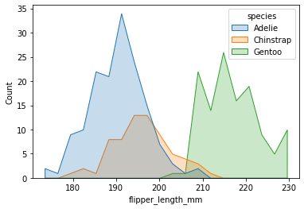
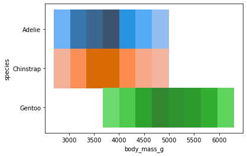
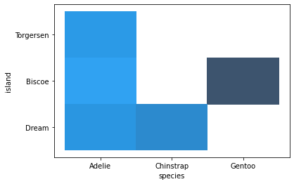

# avans-datascience

# Seaborn
Perform a univariate analysis on all the catagorical data of the penguins dataset. Commit the notebook to your portofolio when you're finished.


```python
import pandas as pd
import seaborn as sns
```


```python
penguins = sns.load_dataset("penguins")
```


```python
penguins.head()
```


<div>
<style scoped>

    .dataframe tbody tr th:only-of-type {
        vertical-align: middle;
    }

    .dataframe tbody tr th {
        vertical-align: top;
    }

    .dataframe thead th {
        text-align: right;
    }

</style>
<table border="1" class="dataframe">
  <thead>
    <tr style="text-align: right;">
      <th></th>
      <th>species</th>
      <th>island</th>
      <th>bill_length_mm</th>
      <th>bill_depth_mm</th>
      <th>flipper_length_mm</th>
      <th>body_mass_g</th>
      <th>sex</th>
    </tr>
  </thead>
  <tbody>
    <tr>
      <th>0</th>
      <td>Adelie</td>
      <td>Torgersen</td>
      <td>39.1</td>
      <td>18.7</td>
      <td>181.0</td>
      <td>3750.0</td>
      <td>Male</td>
    </tr>
    <tr>
      <th>1</th>
      <td>Adelie</td>
      <td>Torgersen</td>
      <td>39.5</td>
      <td>17.4</td>
      <td>186.0</td>
      <td>3800.0</td>
      <td>Female</td>
    </tr>
    <tr>
      <th>2</th>
      <td>Adelie</td>
      <td>Torgersen</td>
      <td>40.3</td>
      <td>18.0</td>
      <td>195.0</td>
      <td>3250.0</td>
      <td>Female</td>
    </tr>
    <tr>
      <th>3</th>
      <td>Adelie</td>
      <td>Torgersen</td>
      <td>NaN</td>
      <td>NaN</td>
      <td>NaN</td>
      <td>NaN</td>
      <td>NaN</td>
    </tr>
    <tr>
      <th>4</th>
      <td>Adelie</td>
      <td>Torgersen</td>
      <td>36.7</td>
      <td>19.3</td>
      <td>193.0</td>
      <td>3450.0</td>
      <td>Female</td>
    </tr>
  </tbody>
</table>
</div>


```python
penguins["species"].unique()
```


    array(['Adelie', 'Chinstrap', 'Gentoo'], dtype=object)


```python
from matplotlib import pyplot as plt
```

## Welke penguins hebben verschillende maten flippers


```python
sns.histplot(data=penguins, x="flipper_length_mm", bins=20, hue="species", element="poly")
```


    <AxesSubplot:xlabel='flipper_length_mm', ylabel='Count'>


    

    


## Welke penguins zijn hoe zwaar


```python
sns.histplot(penguins, x="body_mass_g", y="species", hue="species", legend=False)
```


    <AxesSubplot:xlabel='body_mass_g', ylabel='species'>


    

    


## Welke penguins komen waar voor


```python
sns.histplot(penguins, x="species", y="island")
```


    <AxesSubplot:xlabel='species', ylabel='island'>


    

    


```python
penguins[penguins.island == "Dream"].species.unique()
```


    array(['Adelie', 'Chinstrap'], dtype=object)


```python
penguins[penguins.island == "Biscoe"].species.unique()
```


    array(['Adelie', 'Gentoo'], dtype=object)


```python
penguins[penguins.island == "Torgersen"].species.unique()
```


    array(['Adelie'], dtype=object)


