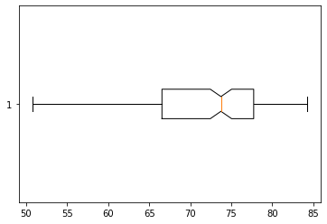
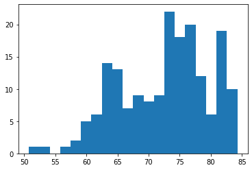

# avans-datascience

- Download the lifeExpectancyAtBirth.csv from Onderwijsmateriaal/Datasets on Blackboard
- Move the file to the same folder as the Notebook you will be working in
- Load the dataset in your Notebook with the following code: lifeExpectancy = pd.read_csv("Datasets/lifeExpectancyAtBirth.csv", sep=",")
- Look at the dataset with the .head() function
- Filter the dataframe: We only want the life expectancy data about 2019 and "Both sexes"
- Use this dataframe to perform a univariate analysis on the life expectancy of 2019

Commit the notebook and dataset to your portofolio when you're finished.

```python
import pandas as pd
from matplotlib import pyplot as pl
```


```python
lifeExpectancy = pd.read_csv("lifeExpectancyAtBirth.csv", sep=",")
```

## Look at the dataset with the .head() function


```python
lifeExpectancy.head()
```


<div>
<table border="1" class="dataframe">
  <thead>
    <tr style="text-align: right;">
      <th></th>
      <th>Location</th>
      <th>Period</th>
      <th>Indicator</th>
      <th>Dim1</th>
      <th>First Tooltip</th>
    </tr>
  </thead>
  <tbody>
    <tr>
      <th>0</th>
      <td>Afghanistan</td>
      <td>2019</td>
      <td>Life expectancy at birth (years)</td>
      <td>Both sexes</td>
      <td>63.21</td>
    </tr>
    <tr>
      <th>1</th>
      <td>Afghanistan</td>
      <td>2019</td>
      <td>Life expectancy at birth (years)</td>
      <td>Male</td>
      <td>63.29</td>
    </tr>
    <tr>
      <th>2</th>
      <td>Afghanistan</td>
      <td>2019</td>
      <td>Life expectancy at birth (years)</td>
      <td>Female</td>
      <td>63.16</td>
    </tr>
    <tr>
      <th>3</th>
      <td>Afghanistan</td>
      <td>2015</td>
      <td>Life expectancy at birth (years)</td>
      <td>Both sexes</td>
      <td>61.65</td>
    </tr>
    <tr>
      <th>4</th>
      <td>Afghanistan</td>
      <td>2015</td>
      <td>Life expectancy at birth (years)</td>
      <td>Male</td>
      <td>61.04</td>
    </tr>
  </tbody>
</table>
</div>


## Filter the dataframe: We only want the life expectancy data about 2019 and "Both sexes"


```python
le = lifeExpectancy[(lifeExpectancy.Period == 2019) 
                    & (lifeExpectancy.Dim1 == "Both sexes")]
```


```python
le.head()
```


<div>
<style scoped>
    .dataframe tbody tr th:only-of-type {
        vertical-align: middle;
    }

    .dataframe tbody tr th {
        vertical-align: top;
    }

    .dataframe thead th {
        text-align: right;
    }
</style>
<table border="1" class="dataframe">
  <thead>
    <tr style="text-align: right;">
      <th></th>
      <th>Location</th>
      <th>Period</th>
      <th>Indicator</th>
      <th>Dim1</th>
      <th>First Tooltip</th>
    </tr>
  </thead>
  <tbody>
    <tr>
      <th>0</th>
      <td>Afghanistan</td>
      <td>2019</td>
      <td>Life expectancy at birth (years)</td>
      <td>Both sexes</td>
      <td>63.21</td>
    </tr>
    <tr>
      <th>12</th>
      <td>Albania</td>
      <td>2019</td>
      <td>Life expectancy at birth (years)</td>
      <td>Both sexes</td>
      <td>78.00</td>
    </tr>
    <tr>
      <th>24</th>
      <td>Algeria</td>
      <td>2019</td>
      <td>Life expectancy at birth (years)</td>
      <td>Both sexes</td>
      <td>77.13</td>
    </tr>
    <tr>
      <th>36</th>
      <td>Angola</td>
      <td>2019</td>
      <td>Life expectancy at birth (years)</td>
      <td>Both sexes</td>
      <td>63.06</td>
    </tr>
    <tr>
      <th>48</th>
      <td>Antigua and Barbuda</td>
      <td>2019</td>
      <td>Life expectancy at birth (years)</td>
      <td>Both sexes</td>
      <td>76.45</td>
    </tr>
  </tbody>
</table>
</div>


## Use this dataframe to perform a univariate analysis on the life expectancy of 2019


Gemiddelde levensverwachtingen van alle landen


```python
round(le["First Tooltip"].mean(), 1)
```


    72.5


Land met hoogste levensverwachting & Land met laagste levensverwachting


```python
le[le["First Tooltip"] == le["First Tooltip"].max()]
```


<div>
<style scoped>
    .dataframe tbody tr th:only-of-type {
        vertical-align: middle;
    }

    .dataframe tbody tr th {
        vertical-align: top;
    }

    .dataframe thead th {
        text-align: right;
    }
</style>
<table border="1" class="dataframe">
  <thead>
    <tr style="text-align: right;">
      <th></th>
      <th>Location</th>
      <th>Period</th>
      <th>Indicator</th>
      <th>Dim1</th>
      <th>First Tooltip</th>
    </tr>
  </thead>
  <tbody>
    <tr>
      <th>997</th>
      <td>Japan</td>
      <td>2019</td>
      <td>Life expectancy at birth (years)</td>
      <td>Both sexes</td>
      <td>84.26</td>
    </tr>
  </tbody>
</table>
</div>


```python
le[le["First Tooltip"] == le["First Tooltip"].min()]
```


<div>
<style scoped>
    .dataframe tbody tr th:only-of-type {
        vertical-align: middle;
    }

    .dataframe tbody tr th {
        vertical-align: top;
    }

    .dataframe thead th {
        text-align: right;
    }
</style>
<table border="1" class="dataframe">
  <thead>
    <tr style="text-align: right;">
      <th></th>
      <th>Location</th>
      <th>Period</th>
      <th>Indicator</th>
      <th>Dim1</th>
      <th>First Tooltip</th>
    </tr>
  </thead>
  <tbody>
    <tr>
      <th>1117</th>
      <td>Lesotho</td>
      <td>2019</td>
      <td>Life expectancy at birth (years)</td>
      <td>Both sexes</td>
      <td>50.75</td>
    </tr>
  </tbody>
</table>
</div>


Mediaan van alle landen


```python
le["First Tooltip"].median()
```


    73.74


Standaardafwijking


```python
round(le["First Tooltip"].std(), 1)
```


    7.1


### Boxplot van levensverwachting


```python
pl.boxplot(le["First Tooltip"], notch = True, vert = 0)
pl.show()
```


    

    


### Histogram over verspreiding van leeftijden


```python
pl.hist(le["First Tooltip"], bins=20)
pl.show()
```


    

    


```python

```
