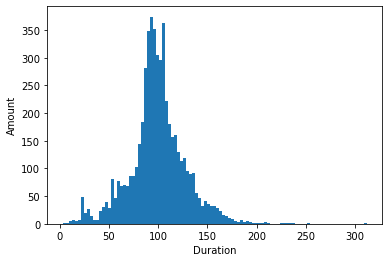

# avans-datascience

Perform a univariate analysis on at least 2 columns with categorical data and on at least 2 columns with numerical data in the dataset that you chose in portofolio assignment 4. Commit the Notebook to your portofolio when you're finished.

```python
import pandas as pd
from matplotlib import pyplot as pl 
```

# Netflix Univariate Analysis


```python
nf = pd.read_csv("../Opdracht_4/netflix_titles.csv", sep=",")
```


```python
nf.head()
```


<div>
<table border="1" class="dataframe">
  <thead>
    <tr style="text-align: right;">
      <th></th>
      <th>show_id</th>
      <th>type</th>
      <th>title</th>
      <th>director</th>
      <th>cast</th>
      <th>country</th>
      <th>date_added</th>
      <th>release_year</th>
      <th>rating</th>
      <th>duration</th>
      <th>listed_in</th>
      <th>description</th>
    </tr>
  </thead>
  <tbody>
    <tr>
      <th>0</th>
      <td>s1</td>
      <td>TV Show</td>
      <td>3%</td>
      <td>NaN</td>
      <td>João Miguel, Bianca Comparato, Michel Gomes, R...</td>
      <td>Brazil</td>
      <td>August 14, 2020</td>
      <td>2020</td>
      <td>TV-MA</td>
      <td>4 Seasons</td>
      <td>International TV Shows, TV Dramas, TV Sci-Fi &amp;...</td>
      <td>In a future where the elite inhabit an island ...</td>
    </tr>
    <tr>
      <th>1</th>
      <td>s2</td>
      <td>Movie</td>
      <td>7:19</td>
      <td>Jorge Michel Grau</td>
      <td>Demián Bichir, Héctor Bonilla, Oscar Serrano, ...</td>
      <td>Mexico</td>
      <td>December 23, 2016</td>
      <td>2016</td>
      <td>TV-MA</td>
      <td>93 min</td>
      <td>Dramas, International Movies</td>
      <td>After a devastating earthquake hits Mexico Cit...</td>
    </tr>
    <tr>
      <th>2</th>
      <td>s3</td>
      <td>Movie</td>
      <td>23:59</td>
      <td>Gilbert Chan</td>
      <td>Tedd Chan, Stella Chung, Henley Hii, Lawrence ...</td>
      <td>Singapore</td>
      <td>December 20, 2018</td>
      <td>2011</td>
      <td>R</td>
      <td>78 min</td>
      <td>Horror Movies, International Movies</td>
      <td>When an army recruit is found dead, his fellow...</td>
    </tr>
    <tr>
      <th>3</th>
      <td>s4</td>
      <td>Movie</td>
      <td>9</td>
      <td>Shane Acker</td>
      <td>Elijah Wood, John C. Reilly, Jennifer Connelly...</td>
      <td>United States</td>
      <td>November 16, 2017</td>
      <td>2009</td>
      <td>PG-13</td>
      <td>80 min</td>
      <td>Action &amp; Adventure, Independent Movies, Sci-Fi...</td>
      <td>In a postapocalyptic world, rag-doll robots hi...</td>
    </tr>
    <tr>
      <th>4</th>
      <td>s5</td>
      <td>Movie</td>
      <td>21</td>
      <td>Robert Luketic</td>
      <td>Jim Sturgess, Kevin Spacey, Kate Bosworth, Aar...</td>
      <td>United States</td>
      <td>January 1, 2020</td>
      <td>2008</td>
      <td>PG-13</td>
      <td>123 min</td>
      <td>Dramas</td>
      <td>A brilliant group of students become card-coun...</td>
    </tr>
  </tbody>
</table>
</div>


```python
nf.count()
```


    show_id         7787
    type            7787
    title           7787
    director        5398
    cast            7069
    country         7280
    date_added      7777
    release_year    7787
    rating          7780
    duration        7787
    listed_in       7787
    description     7787
    dtype: int64


## Hoeveel verschillende soorten films zijn er
Weergegeven in een circeldiagram


```python
nf.type.value_counts().plot(kind="pie", autopct="%.1f%%", legend=True, ylabel="")
```


    <AxesSubplot:>


    

    


## Welke directors hebben hoeveel films gemaakt


```python
films = nf[(nf.director.isna() == False) 
                        & (nf.country == "Netherlands")]
```


```python
films.director.value_counts().plot(kind="bar")
```


    <AxesSubplot:>


    

    


## Hoeveel films zijn er per jaar gemaakt


```python
years = nf.release_year.unique()
filmsList = []

years.sort()

for year in years:
    amount = len(nf[nf.release_year == year])
    filmsList.append(amount)
```


```python
pl.plot(years, filmsList)
pl.xlabel("Year")
pl.ylabel("Amount")
pl.title("Amount of films per year")
```


    Text(0.5, 1.0, 'Amount of films per year')


    

    


## Hoeveel films hebben welke rating


```python
nf.rating.value_counts().plot(kind = 'bar')
```


    <AxesSubplot:>


    

    


## Hoelang zijn de films


```python
def convertString(str):
    return int(str.split(" ")[0])
```


```python
durations = nf.duration[nf.type == "Movie"]

converted_durations = []

for v in durations:
    converted_durations.append(convertString(v))
```


```python
pl.hist(converted_durations, bins=101)
pl.xlabel("Duration")
pl.ylabel("Amount")
```


    Text(0, 0.5, 'Amount')


    

    


## Boxplot van de uitgebrachte zonder uitschieters


```python
round(nf.release_year.mean(), 2)
```


    2013.93


```python
nf.release_year.median()
```


    2017.0


```python
round(nf.release_year.std(), 2)
```


    8.76


```python
pl.boxplot(nf.release_year, vert=False, showfliers=False)
pl.show()
```


    

    


# Durations

Gemiddelde van durations (converted)


```python
drt = pd.DataFrame(converted_durations)
```


```python
drt.mean()
```


    0    99.307978
    dtype: float64


Mediaan van durations (converted)


```python
drt.median()
```


    0    98.0
    dtype: float64


Standaartafwijking van durations (converted)


```python
drt.std()
```


    0    28.530881
    dtype: float64


## Boxplot van de duur van films zonder uitschieters


```python
pl.boxplot(converted_durations, vert=False, showfliers=False)
pl.show()
```


    

    

