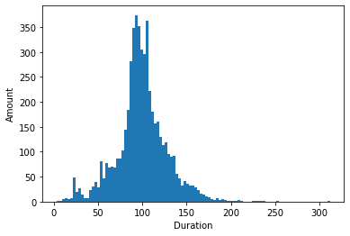

# avans-datascience

## Is er sprake van normaal of uniforme distributie?

Voor deze opdracht heb ik de grafieken vergeleken met de grafieken op [deze site](https://itl.nist.gov/div898/handbook/eda/section3/eda366.htm).

### Grafiek 1

Op deze grafiek is te zien welke films hoe lang zijn.
Er is sprake van een _normale_ distributie

### Grafiek 2
Op deze grafiek is te zien hoeveel films er per jaar gemaakt zijn
Het lijkt erop dat er sprake is van een _lognormale_ distributie is. Het lijkt erop dat in 2020 bijna geen films gemaakt zijn, dit zou kunnen komen omdat er wellicht data missend is in de dataset.   Ook kan het zijn omdat er door de internationale corona-crisis nauwelijks films in 2020 gemaakt zijn.

