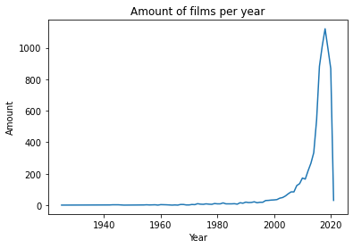

# avans-datascience

- Calculate the 90%, 95%, 99% and 99.99% confidence interval for at least 2 columns with numerical data in the dataset that you chose in portofolio assignment 4. Do you see the impact the confidence has on the interval?
- Now calculate the 95% confidence interval again but use only the first 10% of your rows. Compare this interval to the previous 95% confidence interval you calculated. Do you see the impact of having less data?

```python
import pandas as pd
import numpy as np
import scipy.stats as sp
from matplotlib import pyplot as pl
```


```python
nf = pd.read_csv("../Opdracht_4/netflix_titles.csv")
```

## Confidence intervals


```python
nf.head()
```


<div>
<table border="1" class="dataframe">
  <thead>
    <tr style="text-align: right;">
      <th></th>
      <th>show_id</th>
      <th>type</th>
      <th>title</th>
      <th>director</th>
      <th>cast</th>
      <th>country</th>
      <th>date_added</th>
      <th>release_year</th>
      <th>rating</th>
      <th>duration</th>
      <th>listed_in</th>
      <th>description</th>
    </tr>
  </thead>
  <tbody>
    <tr>
      <th>0</th>
      <td>s1</td>
      <td>TV Show</td>
      <td>3%</td>
      <td>NaN</td>
      <td>João Miguel, Bianca Comparato, Michel Gomes, R...</td>
      <td>Brazil</td>
      <td>August 14, 2020</td>
      <td>2020</td>
      <td>TV-MA</td>
      <td>4 Seasons</td>
      <td>International TV Shows, TV Dramas, TV Sci-Fi &amp;...</td>
      <td>In a future where the elite inhabit an island ...</td>
    </tr>
    <tr>
      <th>1</th>
      <td>s2</td>
      <td>Movie</td>
      <td>7:19</td>
      <td>Jorge Michel Grau</td>
      <td>Demián Bichir, Héctor Bonilla, Oscar Serrano, ...</td>
      <td>Mexico</td>
      <td>December 23, 2016</td>
      <td>2016</td>
      <td>TV-MA</td>
      <td>93 min</td>
      <td>Dramas, International Movies</td>
      <td>After a devastating earthquake hits Mexico Cit...</td>
    </tr>
    <tr>
      <th>2</th>
      <td>s3</td>
      <td>Movie</td>
      <td>23:59</td>
      <td>Gilbert Chan</td>
      <td>Tedd Chan, Stella Chung, Henley Hii, Lawrence ...</td>
      <td>Singapore</td>
      <td>December 20, 2018</td>
      <td>2011</td>
      <td>R</td>
      <td>78 min</td>
      <td>Horror Movies, International Movies</td>
      <td>When an army recruit is found dead, his fellow...</td>
    </tr>
    <tr>
      <th>3</th>
      <td>s4</td>
      <td>Movie</td>
      <td>9</td>
      <td>Shane Acker</td>
      <td>Elijah Wood, John C. Reilly, Jennifer Connelly...</td>
      <td>United States</td>
      <td>November 16, 2017</td>
      <td>2009</td>
      <td>PG-13</td>
      <td>80 min</td>
      <td>Action &amp; Adventure, Independent Movies, Sci-Fi...</td>
      <td>In a postapocalyptic world, rag-doll robots hi...</td>
    </tr>
    <tr>
      <th>4</th>
      <td>s5</td>
      <td>Movie</td>
      <td>21</td>
      <td>Robert Luketic</td>
      <td>Jim Sturgess, Kevin Spacey, Kate Bosworth, Aar...</td>
      <td>United States</td>
      <td>January 1, 2020</td>
      <td>2008</td>
      <td>PG-13</td>
      <td>123 min</td>
      <td>Dramas</td>
      <td>A brilliant group of students become card-coun...</td>
    </tr>
  </tbody>
</table>
</div>


### Confidence intervals op hoeveel films welke lengte hebben

#### Grafiek


```python
def convertString(str):
    return int(str.split(" ")[0])

durations = nf.duration[nf.type == "Movie"]

converted_durations = []

for v in durations:
    converted_durations.append(convertString(v))

pl.hist(converted_durations, bins=101)
pl.xlabel("Duration")
pl.ylabel("Amount")
```


    Text(0, 0.5, 'Amount')


    

    


#### Confidence intervals

Confidence met 90%


```python
durations_dataframe = pd.DataFrame(converted_durations)
sp.t.interval(0.9, len(converted_durations) - 1, loc=durations_dataframe.mean(), scale=sp.sem(durations_dataframe))
```


    (array([98.66787926]), array([99.94807759]))


Confidence met 95%


```python
durations_dataframe = pd.DataFrame(converted_durations)
sp.t.interval(0.95, len(converted_durations) - 1, loc=durations_dataframe.mean(), scale=sp.sem(durations_dataframe))
```


    (array([98.54521293]), array([100.07074392]))


Confidence met 99%


```python
durations_dataframe = pd.DataFrame(converted_durations)
sp.t.interval(0.99, len(converted_durations) - 1, loc=durations_dataframe.mean(), scale=sp.sem(durations_dataframe))
```


    (array([98.30540438]), array([100.31055248]))


Confidence met 99.99%


```python
durations_dataframe = pd.DataFrame(converted_durations)
sp.t.interval(0.9999, len(converted_durations) - 1, loc=durations_dataframe.mean(), scale=sp.sem(durations_dataframe))
```


    (array([97.79306844]), array([100.82288842]))


### Confidence met 10% van de data

#### Grafiek


```python
first_10p = converted_durations[:int(len(converted_durations) * 0.1)]
```


```python
pl.hist(first_10p, bins=101)
pl.xlabel("Duration")
pl.ylabel("Amount")
```


    Text(0, 0.5, 'Amount')


    

    


#### Confidence


```python
first_10p_dataframe = pd.DataFrame(first_10p)
sp.t.interval(0.95, len(first_10p_dataframe) - 1, loc=first_10p_dataframe.mean(), scale=sp.sem(first_10p_dataframe))
```


    (array([96.84337747]), array([101.67431341]))


### Confidence interval op hoeveel films er paar jaar zijn gemaakt

#### Grafiek


```python
years = nf.release_year.unique()
filmsList = []

years.sort()

for year in years:
    amount = len(nf[nf.release_year == year])
    filmsList.append(amount)
    
pl.plot(years, filmsList)
pl.xlabel("Year")
pl.ylabel("Amount")
pl.title("Amount of films per year")
```


    Text(0.5, 1.0, 'Amount of films per year')


    

    


#### Confidence interval op amount of films per jaar

Confidence met 90%


```python
films_list_dataframe = pd.DataFrame(filmsList)
sp.t.interval(0.9, len(filmsList) - 1, loc=films_list_dataframe.mean(), scale=sp.sem(films_list_dataframe))
```


    (array([57.2303728]), array([156.11209296]))


```python
films_list_dataframe.mean()
```


    0    106.671233
    dtype: float64


Confidence met 95%


```python
films_list_dataframe = pd.DataFrame(filmsList)
sp.t.interval(0.95, len(filmsList) - 1, loc=films_list_dataframe.mean(), scale=sp.sem(films_list_dataframe))
```


    (array([47.52286456]), array([165.81960119]))


Confidence met 99%


```python
films_list_dataframe = pd.DataFrame(filmsList)
sp.t.interval(0.99, len(filmsList) - 1, loc=films_list_dataframe.mean(), scale=sp.sem(films_list_dataframe))
```


    (array([28.16574833]), array([185.17671743]))


Confidence met 99.99%


```python
films_list_dataframe = pd.DataFrame(filmsList)
sp.t.interval(0.9999, len(filmsList) - 1, loc=films_list_dataframe.mean(), scale=sp.sem(films_list_dataframe))
```


    (array([-15.5701918]), array([228.91265756]))


### Confidence met 10% van de data


```python
f10p = filmsList[:int(len(filmsList) * 0.1)]
```


```python
f10p_df = pd.DataFrame(f10p)
sp.t.interval(0.95, len(f10p_df) - 1, loc=f10p_df.mean(), scale=sp.sem(f10p_df))
```


    (array([1.31074067]), array([2.97497361]))


